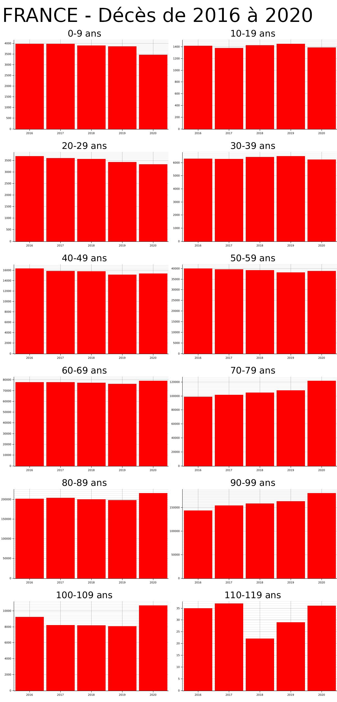
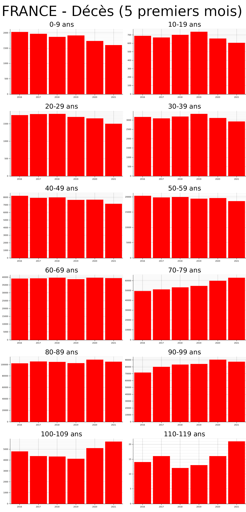

# world-data
Parse data and generate charts using rust.

## Generated reports

Both report 1 and 2 have been generated using official data from the Insee.
The data can be found here: https://www.data.gouv.fr/fr/datasets/fichier-des-personnes-decedees/ 

### Report 1 - Death full year

This report shows the number people who have died in France :
- From 2016 to 2020
- By age group

### Report 2 - Death part year

This report shows the number of people who have died in France :
- Only between January and May
- From 2016 to 2021
- By age group

